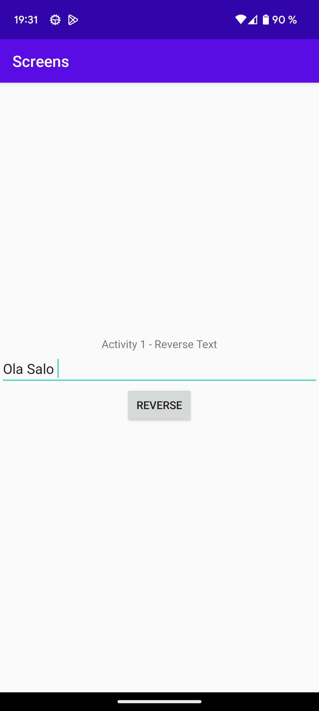
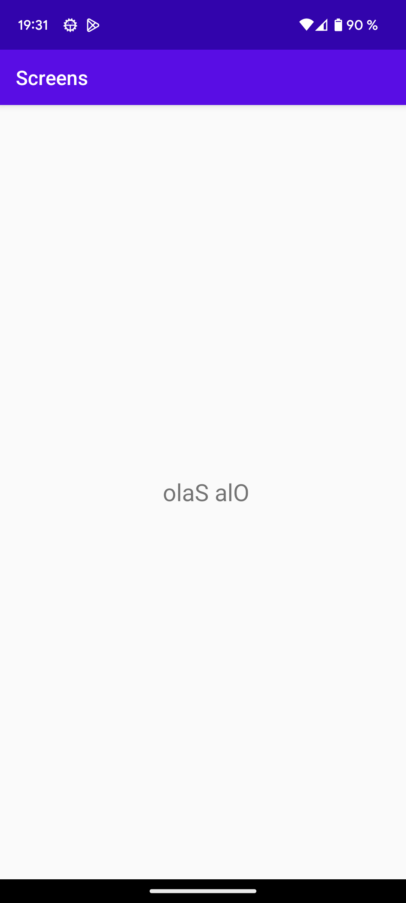

# Rapport


In the MainActivity i have added a EditText Widget to take a text to be reversed. 
```
<EditText
    android:id="@+id/reverseInput"
    android:layout_width="fill_parent"
    android:layout_height="wrap_content"
    android:inputType="text" />
```

In addition i have added a button that will create a new intent and add the input from the EditText to the bundle of the intent. And then start an activity using this intent. 
```
<Button
    android:id="@+id/button"
    android:layout_width="wrap_content"
    android:layout_height="wrap_content"
    android:text="Reverse" />
```
```
String inputText = String.valueOf(input.getText()); //Get text inside the EditText
Intent intent = new Intent(MainActivity.this, MainActivity2.class); //Intent wit the two activities
intent.putExtra("input", inputText); //add the input to the bundle
startActivity(intent);    
```
Ive also added som additional code to prevent the user from starting the activity without entering anything into the EditText
```
if (TextUtils.isEmpty(input.getText())) { //Prevent the user from starting the activity if EditText is empty
    errorText.setText("Please enter text to reverse"); //Tells the user to enter text before moving on
}
```
Lastly in the 2nd activity i had added code to take the input from the intent bundle, reverse it and then add it to a TextView in the 2nd activity.
```
if (extras != null) {
    inputText = extras.getString("input"); //Get the input from bundle
    final TextView reversedTextView = findViewById(R.id.reversedText);
    StringBuilder reversedText = new StringBuilder(inputText).reverse(); //Reverse the input
    reversedTextView.setText(reversedText); //Add the reversed input to the TextView
}
```


Picture of first activity with text to be reversed


Picture of second activity with text reversed
